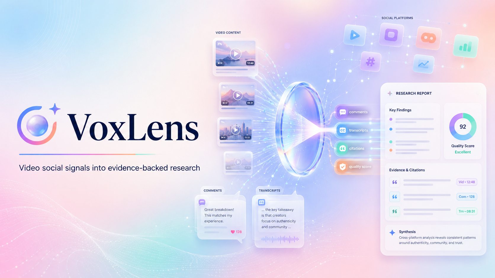

# Turn Social Video Evidence Into Citable Research

<p align="center">
  <a href="README.md">English</a> · <a href="README.zh-CN.md">中文</a>
</p>



> Evidence-first DeepResearch for social video. Give VoxLens a research question and it searches Bilibili, Douyin, YouTube, Xiaohongshu/RedNote, Zhihu, Kuaishou, Weibo and similar sources, samples titles, metadata, comments and transcripts/text snippets when available, then generates a citable report with source references and quality checks.

## Important Risk Notice

VoxLens uses crawler-style collection and browser automation in local alpha mode. Before using it, read the following carefully:

- Platform terms, robots rules, anti-abuse policies and local laws remain your responsibility.
- Misuse, high-frequency access, automated login, abnormal cookie use or attempts to bypass platform controls may trigger rate limits, verification challenges, account suspension, account bans, IP blocking or other enforcement. This risk is especially relevant for platforms such as Xiaohongshu/RedNote (XHS), Douyin, Bilibili, Kuaishou, Weibo and Zhihu.
- VoxLens is intended for low-frequency personal, learning, research and internal evaluation. Do not use it for mass crawling, spam, surveillance, credential harvesting, resale of collected data or activity that disrupts platform operations.
- Cookies and logged-in browser sessions can expose account privileges. Use dedicated test accounts where possible and avoid collecting private, sensitive or non-public data.
- The project is provided as-is. You are responsible for any platform warnings, account restrictions, data loss, legal claims or business interruption caused by how you run it.

See [LICENSE](LICENSE), [THIRD_PARTY_NOTICES.md](THIRD_PARTY_NOTICES.md) and [packages/crawler/LICENSE](packages/crawler/LICENSE) before redistribution, production use or commercial use.

## Positioning

VoxLens is an evidence-first research product for social-video intelligence. It helps product, marketing, operations, content and research teams turn scattered signals from titles, descriptions, comments, transcripts, creator posts and platform metadata into business insights that can be cited, reviewed and reused.

The goal is not to crawl more data or imply that every frame has been understood. The goal is to convert accessible social-video evidence into structured reports with traceable sources and explicit uncertainty. Frame, audio and visual analysis can enhance the workflow later; the alpha is transcript/comment/context first.

## Demo

| Ask a question | Async generation | Evidence-backed report |
| --- | --- | --- |
|  |  |  |

## Why VoxLens

Real user feedback, purchase sentiment, product discussion and cultural trends increasingly happen inside video platforms and comment sections. These materials are hard for traditional search and generic agents to use well because:

- signals are fragmented across platforms, videos and comment threads;
- video research often starts with titles, descriptions, transcripts/subtitles, comments and platform context; frame or audio analysis is an optional enhancement, not the alpha baseline;
- comment sections are noisy but contain first-hand user language;
- research conclusions often lack traceable evidence;
- business teams need reusable findings, not raw scraped files.

## Core Value

VoxLens helps answer questions such as:

- How do users discuss a brand, product, feature or trend in social video?
- What feedback appears across different video platforms?
- Which pain points, buying motives and use cases appear repeatedly in comments and subtitles?
- Is a market trend creator-led, or has it already reached comment-section consensus?
- What are the reputation risks, objections and opportunity gaps around competitors?

## Use Cases

### Market Trend Research

Input a trend, category or keyword and quickly summarize platform coverage, representative opinions, sentiment and opportunities.

Best for early trend validation, campaign research, social listening and content planning.

### User Needs and Pain Points

Extract authentic user language from comments and transcripts around a product, feature or use case.

Best for product discovery, growth bottleneck analysis, positioning and early market validation.

### Competitor and Brand Reputation

Research brand names, competitor names or category keywords across social-video sources, then summarize feedback, selling points, controversies and reusable evidence.

Best for competitor research, brand monitoring, messaging analysis and product positioning.

### Content and Creator Research

Understand topic structure, video narratives, creator angles and audience concerns.

Best for content strategy, short-video topics, creator partnership screening and account retrospectives.

## Alpha Capabilities

- **Async research runs**: create a run, stream progress, persist results and reopen a report by runId.
- **Cross-platform social-video search**: Bilibili, Douyin, YouTube, Xiaohongshu/RedNote, Zhihu, Kuaishou and Weibo are the default alpha targets.
- **Evidence-first sampling**: collect titles, metadata, comment samples and transcript/text snippets where available; visual/audio understanding is treated as a later enhancement rather than a required claim.
- **LLM evidence-backed synthesis**: OpenRouter-backed report generation binds important claims to source IDs; deterministic reports are used when no model is configured.
- **Quality evaluation**: each report evaluates coverage, citation accuracy, evidence strength and conclusion risk.
- **Integrated crawler runtime**: local crawler adapters, OpenCLI and yt-dlp are orchestrated behind VoxLens provider interfaces so production providers can replace them later.

## Difference From Generic Agents

| Dimension | Generic Agent / Research Tool | VoxLens |
| --- | --- | --- |
| Goal | Broad task execution and web search | Evidence-backed social-video research |
| Sources | Web pages, documents and tool calls | Videos, transcripts, comments, creator content and social posts |
| Best questions | Open-ended browsing and task execution | Market insight, user feedback, trend analysis and competitor reputation |
| Output | Summaries or task results | Source-grounded research reports with quality checks |
| Evidence granularity | Usually web pages or search results | Comment, transcript/text, source and post-level evidence |
| Users | Technical users and general researchers | Product, marketing, operations, content, research and business teams |

VoxLens is not a replacement for a generic agent. It is a vertical research assistant for social-video evidence: find sources, sample the accessible context, cite what supports the claims and mark uncertainty when evidence is thin.

## Recommended Query Style

Better:

```text
Analyze Bilibili and Douyin discussions about AI companion products. Focus on buying motives, concerns and real usage scenarios.
```

Too broad:

```text
AI companion
```

A strong query usually includes the research object, target platforms, questions to answer, output focus and business context.

## Local Alpha Setup

Install local dependencies from the repository root:

```bash
cd /path/to/VoxLens
./scripts/bootstrap.sh
```

Windows PowerShell:

```powershell
cd C:\path\to\VoxLens
.\scripts\bootstrap.ps1
```

Backend API:

```bash
cd apps/api
cp .env.example .env
# Fill OPENROUTER_API_KEY and other local-only settings in .env.
uv sync
uv run uvicorn app.main:app --reload --port 8765
```

Frontend web app:

```bash
cd apps/web
pnpm dev
```

`pnpm` is the supported frontend package manager. Use the bootstrap script for dependency installation, then run targeted commands from each workspace as needed.

## Validation

Run the runtime smoke gate before changing backend, CLI, crawler, scripts or runtime docs:

```bash
./scripts/validate_runtime.sh
```

Optional frontend build check for UI or API-client changes:

```bash
cd apps/web
pnpm build
```

Runtime contract and operations docs:

- [Runtime contract](docs/runtime/deepresearch-runtime-contract.md)
- [Frontend integration](docs/runtime/frontend-integration.md)
- [Ops runbook](docs/runtime/ops-runbook.md)
- [Alpha exit criteria](docs/alpha-exit-criteria.md)

## Current Stage

VoxLens is an internal alpha focused on validating:

- whether the social-video research workflow saves time;
- whether cross-platform sampling produces stable insights;
- whether comments and subtitles support report conclusions;
- whether async runs, persistence and report reopening work well enough for internal testing;
- which scenarios deserve productization first.

Expect platform login friction, coverage gaps, crawler volatility, sample bias and changing anti-automation behavior. Treat every output as research assistance, not as legal, financial, medical or platform-compliance advice.

## License and Third-Party Notices

- Root usage terms and risk disclaimers: [LICENSE](LICENSE)
- Third-party notices: [THIRD_PARTY_NOTICES.md](THIRD_PARTY_NOTICES.md)
- Integrated crawler runtime license: [packages/crawler/LICENSE](packages/crawler/LICENSE)
