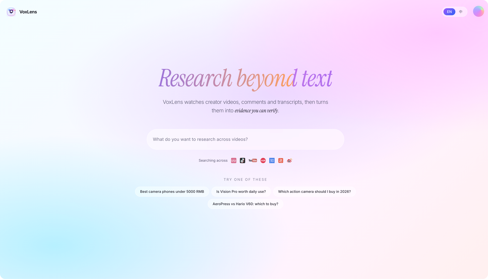
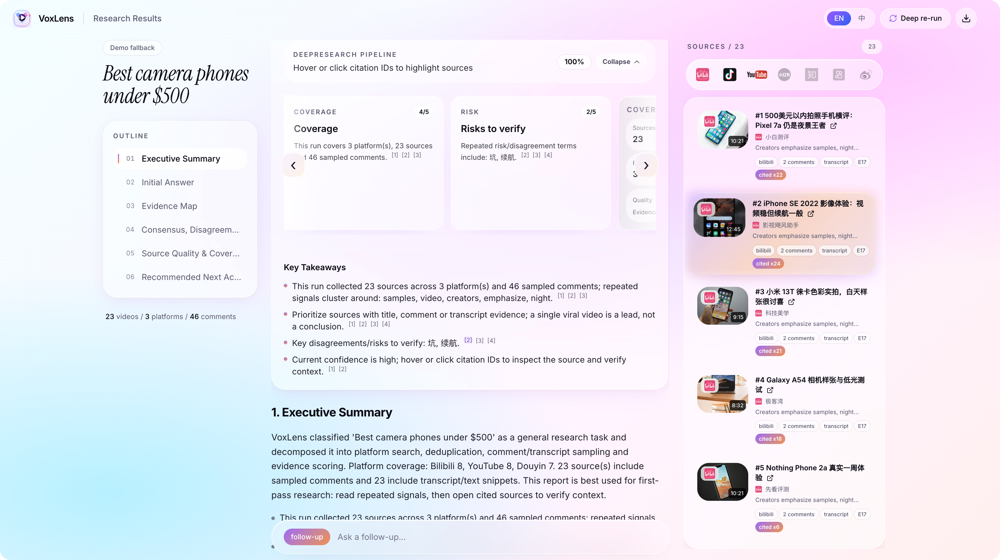

# VoxLens

[English](README.md) | [中文](README.zh-CN.md)

> 面向视频社媒的 DeepResearch alpha：输入一个研究问题，VoxLens 会跨 Bilibili、Douyin、YouTube、小红书/RedNote、知乎、快手、微博等来源搜索内容，采样评论与字幕，并生成带证据引用和质量评估的研究报告。

## 重要风险提示

VoxLens 的本地 alpha 模式会使用爬虫式采集和浏览器自动化能力。使用前请务必理解以下风险：

- 目标平台的服务条款、robots 规则、反滥用策略以及当地法律法规，需要由使用者自行遵守。
- 滥用、高频访问、自动化登录、异常 Cookie 使用或尝试绕过平台风控，可能触发限流、验证码、账号限制、账号封禁、IP 封禁或其他处置。小红书/RedNote（XHS）、抖音、Bilibili、快手、微博、知乎等平台都可能出现这类风险。
- VoxLens 仅面向低频的个人学习、研究和内部评估场景。不得用于大规模爬取、垃圾信息、监控跟踪、凭证收集、倒卖数据或干扰平台正常运行的行为。
- Cookie 与已登录浏览器会暴露账号权限。建议尽量使用测试账号，不要采集私密、敏感或非公开数据。
- 本项目按现状提供。因使用方式导致的平台警告、账号受限、数据损失、法律争议或业务中断，由使用者自行承担。

在重新分发、生产使用或商业使用前，请先阅读 [LICENSE](LICENSE)、[THIRD_PARTY_NOTICES.md](THIRD_PARTY_NOTICES.md) 与 [packages/crawler/LICENSE](packages/crawler/LICENSE)。

## 一句话定位

VoxLens 是一个专注于视频社媒研究的 AI 产品，帮助产品、市场、运营、内容和研究团队，把分散在视频、评论、字幕和创作者内容里的信号，转化为可引用、可复盘、可行动的业务洞察。

VoxLens 的目标不是“多抓数据”，而是把藏在视频社媒里的信号变成结构化、可引用、可评估的研究报告。

## Demo

| 首页提问 | 异步生成中 | 证据型报告 |
| --- | --- | --- |
|  |  |  |

## 为什么需要 VoxLens

真实的用户反馈、消费情绪、产品讨论和文化趋势，越来越多地发生在视频平台和评论区里。但这些内容通常很难被传统搜索和通用 Agent 高效利用：

- 信息分散在不同平台、不同视频和评论区中。
- 视频内容需要结合标题、简介、字幕、关键帧或评论后才适合分析。
- 评论区噪声高，但包含大量一线用户语言。
- 研究结论经常缺少可回溯的证据来源。
- 市场、产品和运营团队需要可复用结论，而不是原始抓取文件。

## 核心价值

VoxLens 帮你更快回答这些问题：

- 用户到底在怎么讨论一个品牌、产品、功能或趋势？
- 一个热点话题在不同视频平台上的真实反馈是什么？
- 评论和字幕里反复出现的痛点、购买动机和使用场景是什么？
- 市场趋势是少数内容带动，还是评论区已经形成共识？
- 竞品在视频社媒中的口碑、争议和机会点在哪里？

## 典型使用场景

### 市场趋势研究

输入趋势、品类或关键词，快速了解它在视频社媒中的讨论热度、代表性观点、用户情绪和潜在机会。

适合：新消费趋势判断、社媒热点复盘、campaign 前期研究、内容选题研究。

### 用户需求与痛点挖掘

围绕产品、功能或使用场景，从评论和字幕中提取真实表达，发现高频需求、抱怨点、购买动机和使用障碍。

适合：产品需求洞察、增长转化阻力分析、用户语言提炼、早期方向验证。

### 竞品与品牌口碑分析

围绕品牌名、竞品名或品类词进行视频社媒研究，整理不同平台上的用户反馈、核心卖点、负面争议和传播素材。

适合：竞品调研、品牌声量观察、用户口碑复盘、产品定位分析。

### 内容与创作者研究

理解一个话题下的视频内容结构、评论反馈、创作者叙事方式和观众关注点。

适合：内容策略、短视频选题、创作者合作筛选、账号复盘。

## Alpha 产品能力

- **异步研究任务**：创建 run 后进入队列，前端可实时观看进度；任务完成后会持久化，支持通过 runId 重新打开。
- **跨平台视频社媒搜索**：默认覆盖 Bilibili、Douyin、YouTube、小红书/RedNote、知乎、快手、微博。
- **评论与字幕采样**：采集视频标题、基础信息、评论区样本、字幕或文本片段，用于后续证据归因。
- **LLM evidence-backed synthesis**：通过 OpenRouter 模型生成报告，要求每个重要判断绑定来源 ID；无模型配置时自动降级到确定性报告。
- **质量评估**：每份报告都会评估覆盖率、引用准确率、证据强度和结论风险，避免把弱证据包装成强结论。
- **一体化采集运行时**：本地 crawler adapter、OpenCLI、yt-dlp 等能力统一在 VoxLens provider 接口内编排；线上稳定 provider 可通过同一接口替换。

## 与通用 Agent / 研究工具的区别

| 对比维度 | 通用 Agent / 研究工具 | VoxLens |
| --- | --- | --- |
| 主要目标 | 完成广泛任务、搜索网页、执行流程 | 从视频社媒中生成可引用研究报告 |
| 信息来源 | 通用网页、搜索结果、文档、工具调用 | 视频、字幕、评论、创作者内容和社媒讨论 |
| 适用问题 | 开放式问答、网页调研、任务执行 | 市场洞察、用户反馈、内容趋势、竞品口碑 |
| 输出方式 | 摘要、任务结果、网页资料整理 | 证据驱动的研究报告和质量评估 |
| 证据粒度 | 通常引用网页或搜索结果 | 更关注评论、字幕、视频来源等一线证据 |
| 面向用户 | 技术用户、研究人员、自动化使用者 | 产品、市场、运营、内容、研究和业务团队 |

VoxLens 不追求替代通用 Agent。它更像一个视频社媒研究助手：帮你找到相关视频，抽样评论和字幕，整理证据，生成业务可读的报告，并标出结论风险。

## 推荐 query 写法

更推荐：

```text
分析 Bilibili 和抖音上关于 AI 陪伴产品的用户讨论，重点总结购买动机、担忧点和真实使用场景。
```

不太推荐：

```text
AI 陪伴
```

好的 query 通常包含研究对象、平台范围、希望回答的问题、输出重点和业务背景。

## 项目结构

```text
apps/api/                 FastAPI research runtime，负责任务队列、采集编排、报告生成
apps/web/                 VoxLens Web 产品界面
packages/crawler/         VoxLens 内置采集运行时，承载中文视频社媒采集能力
packages/research_cli/    本地 research CLI 与脚本化入口
runtime/runs/             本地运行产物、采集缓存和报告事件，不提交到 Git
reports/                  示例报告
docs/runtime/             产品运行时、接口和架构文档
```

`packages/crawler/` 是 VoxLens 的内部运行时组件，不再作为独立爬虫项目对外暴露。上游独立 README、文档站、推广页面和与当前默认视频社媒范围无关的平台路径已经移除；必要的合规声明保留在 [THIRD_PARTY_NOTICES.md](THIRD_PARTY_NOTICES.md) 与 [packages/crawler/LICENSE](packages/crawler/LICENSE)。

## 内部试用启动

首次启动前建议先安装所有本地依赖：

```bash
cd /path/to/VoxLens
./scripts/bootstrap.sh
```

Windows PowerShell：

```powershell
cd C:\path\to\VoxLens
.\scripts\bootstrap.ps1
```

后端 API：

```bash
cd apps/api
cp .env.example .env
# 在 .env 中填入 OPENROUTER_API_KEY 等必要配置；不要把密钥提交到仓库。
uv sync
uv run uvicorn app.main:app --reload --port 8765
```

前端 Web：

```bash
cd apps/web
pnpm dev
```

默认前端地址通常是 `http://127.0.0.1:8080/`，后端 API 是 `http://127.0.0.1:8765/api`。

前端统一使用 `pnpm`。依赖安装优先通过 bootstrap 脚本完成，之后按需进入各 workspace 运行具体命令。

## 验证

修改后端、CLI、crawler、脚本或运行时文档前后，建议运行本地 smoke gate：

```bash
./scripts/validate_runtime.sh
```

如果改动涉及 UI 或 API client，再额外运行前端构建：

```bash
cd apps/web
pnpm build
```

相关项目文档：

- [运行时契约](docs/runtime/deepresearch-runtime-contract.md)
- [前端集成说明](docs/runtime/frontend-integration.md)
- [运维 runbook](docs/runtime/ops-runbook.md)
- [Alpha 退出标准](docs/alpha-exit-criteria.md)

## 当前阶段

VoxLens 处于内部 alpha 阶段，重点验证：

- 视频社媒 research workflow 是否节省时间。
- 跨平台采样是否能稳定产生洞察。
- 评论和字幕证据是否能支撑报告结论。
- 异步 run、持久化、重开报告是否满足内部试用。
- 哪些场景最适合优先产品化。

当前版本可能仍存在平台登录、覆盖不足、抓取波动和样本偏差。请把输出视为研究辅助，而不是法律、金融、医疗或平台合规建议。

## License 与第三方声明

- 根项目使用条款和风险免责声明：[LICENSE](LICENSE)
- 第三方声明：[THIRD_PARTY_NOTICES.md](THIRD_PARTY_NOTICES.md)
- 内置采集运行时 license：[packages/crawler/LICENSE](packages/crawler/LICENSE)
