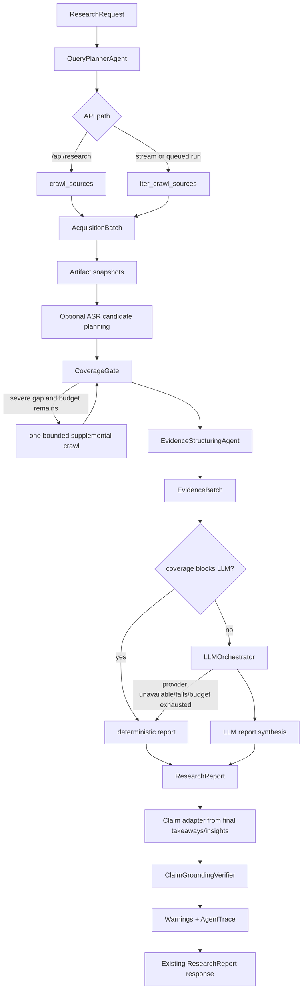

# VoxLens Studio Architecture

## Product Boundary

VoxLens Studio is an evidence-first social-video research workspace. It does not promise universal platform coverage or complete video understanding. The runtime collects evidence through user-controlled providers, preserves source snapshots, applies coverage and grounding checks, and returns the existing `ResearchReport` API contract.

```text
apps/api/                 FastAPI research runtime and agent pipeline
apps/web/                 Vite/React research experience
packages/crawler/         Integrated collection runtime (unchanged by this iteration)
packages/research_cli/    Local research CLI
runtime/runs/             Persisted local run state, ignored by Git
docs/runtime/             API, frontend, and operations contracts
```

## Actual Runtime Flow



Both synchronous and streaming execution call `complete_research_pipeline()` after initial acquisition. The streaming path keeps provider progress and section-delta events, but no longer owns a separate evidence or synthesis implementation.

## Data Contracts

- `PlanSpec`: frozen normalized query, entity, comparison, time-range, evidence-intent, and platform-query contract.
- `AcquisitionBatch`: frozen envelope containing defensive `Source` snapshots, immutable `Artifact` models, and copied `RunLog` records.
- `EvidenceBatch`: frozen evidence-unit and quality-assessment output.
- `ClaimSet`: claims adapted from the final report plus claim-to-evidence candidate links and the coverage report.
- `VerifiedReport`: the unchanged public report plus internal grounding and budget metadata.

The new evidence models are frozen Pydantic models. `AcquisitionBatch` also prevents field reassignment and isolates its snapshots from later mutations to crawler-owned objects. Legacy `Source` remains mutable because existing providers and report decoration depend on that behavior; it is copied at stage boundaries.

## Gates and Budgets

- One `ResearchBudget` ledger covers unique source count, elapsed time, ASR allowance, LLM attempts, and LLM token allowance.
- `CoverageGate` evaluates platforms, entities, evidence modalities, and counterevidence.
- A severe gap permits one bounded supplemental crawl when the stop policy and source budget allow it.
- If a severe gap remains, LLM synthesis is blocked. A deterministic evidence-limited report is still returned with warnings.
- `LLMOrchestrator` owns report-provider retries, fallback, and budget accounting. No production research path calls report LLM synthesis directly.
- `ClaimGroundingVerifier` evaluates claims extracted from the final report, not a separate pre-report synthetic claim set.

## Implemented vs. Skeleton

| Area | Status | Current behavior |
| --- | --- | --- |
| Planner and platform targets | Implemented | Structured question analysis feeds existing crawler targets. |
| Artifact snapshots | Implemented | Public source fields and excluded full transcript fields are hashed and preserved. |
| Coverage retry and LLM gate | Implemented | One bounded retry; unresolved severe gaps block LLM synthesis. |
| Evidence quality | Implemented | One aggregate legacy-adapter `EvidenceUnit` per source with seven-dimensional assessment. |
| Report LLM orchestration | Implemented | Optional OpenRouter synthesis runs through `LLMOrchestrator`; deterministic fallback is always available. |
| Final-claim grounding | Implemented | Final takeaways/insights are adapted to `Claim` and checked before delivery. |
| ASR execution | Skeleton / adapter-ready | Candidate planning is wired into normal runs; `ASRPipeline.run()` requires an execution adapter/provider and is not automatically invoked. |
| Timestamp/comment citation rendering | Library-ready | Parser/formatter/resolver exist, but the public report still uses legacy numeric source IDs for compatibility. |
| Evidence granularity | Transitional | Normal runtime creates one aggregate unit per source; timestamp/comment units are produced only by dedicated ASR/citation flows. |

## Compatibility Rules

- Do not change the `ResearchReport` field set or stream event names without a versioned API change.
- Preserve legacy `Source` JSON keys. Internal `fullTranscript`, `transcriptText`, and `transcriptSegments` remain excluded from API serialization.
- Preserve numeric source citations in current report sections and takeaways.
- Keep crawler access warnings and user-controlled authorization requirements explicit.

## Operational Rules

- Store local API secrets in `apps/api/.env`; never commit `.env` files.
- Persist run records under `runtime/runs/research/` and crawler output under `runtime/runs/crawler/`.
- Run Python compile checks plus `scripts/verify_evidence_model.py` and `scripts/verify_agent_architecture.py` before merging agent changes.
- Run the frontend build when metadata, routes, or API client types change.
