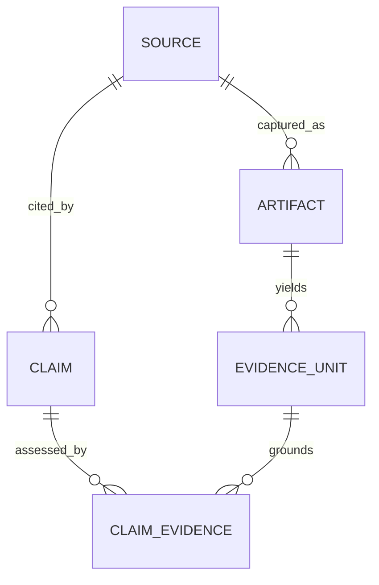

# Evidence Data Model

## Purpose

The evidence model separates collected source metadata from immutable capture versions, reviewable evidence spans, report claims, and assessed claim-evidence relations. The public report remains source-ID based for compatibility, while internal models provide a path to timestamp-, comment-, and frame-level auditability.

## Entities

### Source

`Source` is the legacy provider and API model. It contains platform metadata, comments, transcript previews, ranking fields, and report decoration. Existing JSON keys are preserved.

The following internal fields remain excluded from API serialization:

- `fullTranscript`
- `transcriptText`
- `transcriptSegments`

They are still copied into `Artifact` snapshots so evidence hashing and later extraction do not lose the full captured text.

### Artifact

`Artifact` is a frozen versioned capture or extraction record.

| Field group | Purpose |
| --- | --- |
| `id`, `source_id`, `artifact_type` | Stable identity and source ownership |
| `content_hash`, `captured_at` | Integrity and capture time |
| `collector_name`, `collector_version` | Provenance |
| `storage_uri`, `mime_type` | Optional storage/reference metadata |
| `raw_data`, `raw_metadata` | Captured payload and collector metadata |
| `full_transcript`, `transcript_segments` | Internal transcript preservation |
| `parent_artifact_id` | Derivation chain |

Current acquisition creates `source_snapshot` artifacts. The ASR pipeline can create derived subtitle artifacts.

### EvidenceUnit

`EvidenceUnit` is the smallest independently reviewable evidence span.

Supported modalities are `speech`, `subtitle`, `comment`, `text`, `ocr`, and `metadata`. Location fields support timestamps, comment IDs, parent comments, and frame indexes. Extraction confidence, method, language, speaker, content hash, and review status preserve audit context.

Normal research currently creates one aggregate unit per source. `ASRPipeline.slice_evidence()` can create timestamped speech units. Citation utilities can resolve timestamp/comment references against unit collections.

### Claim

`Claim` represents a final report conclusion selected for grounding review. It records:

- claim text and type;
- categorical confidence;
- cited source IDs;
- linked evidence-unit IDs;
- research run ID;
- review status.

Claims are adapted from final report takeaways and insights so verification covers delivered conclusions rather than a separate synthetic pre-report object.

### ClaimEvidence

`ClaimEvidence` represents the assessed relationship between one claim and one evidence unit:

- `support`
- `contradict`
- `insufficient`

It also supports relevance, directness, independence cluster, freshness, credibility, and rationale fields. The report adapter initializes citation-derived links as `insufficient`; the grounding verifier must establish support or contradiction.

### EvidenceQualityAssessment

Evidence quality uses categorical output (`Strong`, `Moderate`, `Weak`, `Insufficient`) with dimension-level reasons. The seven dimensions are:

1. relevance;
2. directness;
3. integrity;
4. extraction confidence;
5. source credibility;
6. independence;
7. freshness.

The assessment is stored internally and projected onto legacy `Source.quality` and `Source.metrics` fields for the existing report UI.

## Relationships



## Citation Forms

The citation library supports:

```text
[PLATFORM:object-id]
[PLATFORM:object-id@mm:ss-mm:ss]
[PLATFORM:object-id/comment/comment-id]
```

The public `ResearchReport` continues to emit numeric source IDs. Structured citation forms are internal/library-ready until a versioned response contract is introduced.

## Compatibility Guarantees

- No new evidence-domain fields are added to the public `ResearchReport` response.
- Legacy `Source` keys and numeric citations remain unchanged.
- Full transcript fields remain private in API serialization.
- Evidence models can evolve internally as long as adapters preserve the existing report contract.

## Current Limitations

- Aggregate runtime units are broader than ideal citation spans.
- ASR execution is not automatically connected to normal research runs.
- Comment IDs are not consistently supplied by all providers.
- Independence clustering and commercial-risk signals depend on provider metadata.
- The deterministic grounding verifier is lexical/polarity based and requires human review for high-stakes use.
