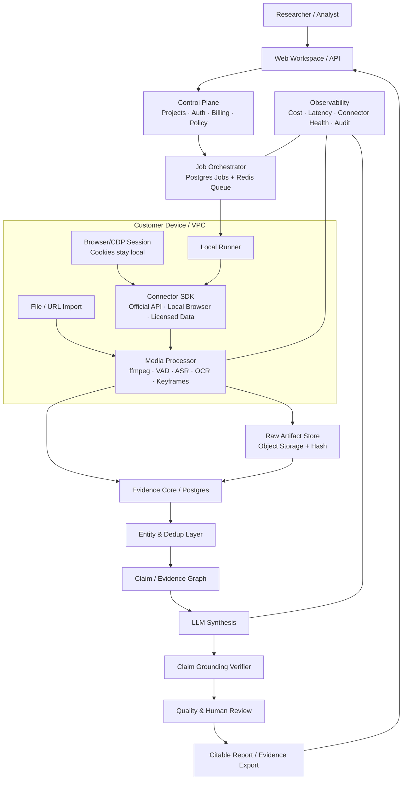
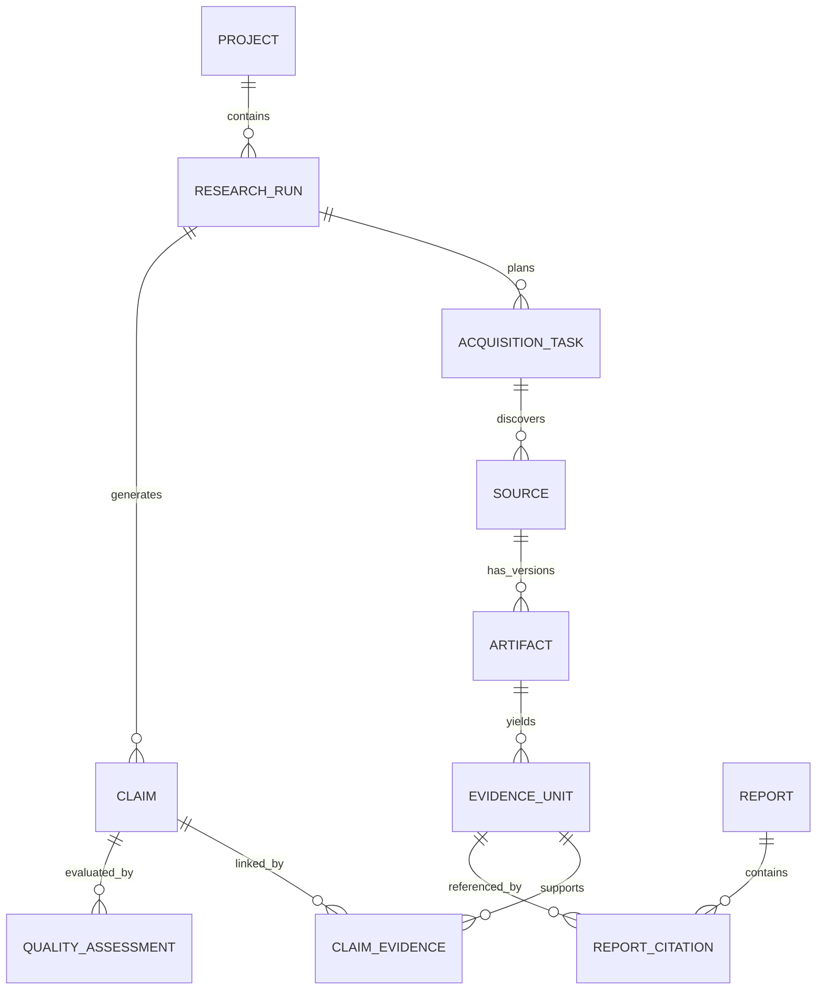

# VoxLens 综合评估与商业化战略报告

> 评估日期：2026-07-17  
> 评估视角：市场分析师 / 早期投资人 / 产品与技术尽调  
> 评估范围：仓库只读分析、公开竞品与市场资料；未运行测试、未修改代码。  
> 非法律意见：平台条款、数据合规和第三方许可证应由专业律师在商业发布前复核。

---

## 0. 执行摘要

### 0.1 一句话结论

**VoxLens 不应继续尝试成为“托管在云端、替用户抓取七个平台的公开 SaaS”，而应转型为“本地/私有部署的中文视频证据研究基础设施 + 高价值研究服务”，以客户自有访问环境执行采集，以 ASR 和可审计 Evidence Store 构成核心产品壁垒。**

### 0.2 投资判断

| 项目 | 判断 | 说明 |
| --- | --- | --- |
| 问题价值 | 高 | 视频、评论和创作者内容确实是网页研究工具覆盖不足的信息层，尤其对中国消费、品牌、内容和产品研究有价值。 |
| 当前产品完成度 | Alpha 可验证 | 异步运行、跨平台 provider、报告流式展示和 LLM 合成已形成完整演示闭环。 |
| 当前技术护城河 | 低 | 主要能力来自第三方 crawler、OpenCLI、yt-dlp 和通用 LLM；缺少自有数据资产、ASR 主链路、证据图谱和长期评测集。 |
| 公开 SaaS 可行性 | 低 | 登录态、验证码、IP/账号风险、平台条款、运维成本和第三方非商业许可证共同否定了公开多租户抓取服务。 |
| 私有化产品可行性 | 中高 | 将采集放到客户本地 Runner，云端只做控制、证据管理和合成，可显著降低账号托管与集中封禁风险。 |
| 研究服务化可行性 | 高 | 在产品稳定前，以“交付可引用证据包和研究报告”收费，可以验证付费意愿并积累行业 ontology、评测集和模板。 |
| 推荐融资属性 | 暂不适合纯软件规模化叙事 | 先证明 5–10 个付费设计伙伴、重复使用率和毛利，再决定是否走软件公司或研究服务公司路线。 |

### 0.3 最关键的五个判断

1. **当前最大阻碍不是队列，而是采集合法性、可持续性和许可证。** 内置 `packages/crawler/` 明确采用“NON-COMMERCIAL LEARNING LICENSE 1.1”，未经书面同意不可商业使用；这意味着现有 crawler 不能直接成为收费产品的生产内核（`packages/crawler/LICENSE:1`、`packages/crawler/LICENSE:18`、`packages/crawler/main.py:1`）。
2. **“Evidence-first”目前主要是产品叙事，不是完整的数据架构。** 仓库没有独立 EvidenceStore；`Source` 同时承担来源、正文、评论、字幕、质量和引用对象，且完整字幕字段被 `exclude=True` 排除出持久化报告（`apps/api/app/models.py:54`、`apps/api/app/models.py:70`）。
3. **Agent 流水线结构合理，但智能密度被高估。** Planner 是规则扩词，Crawler 是并发 adapter，Evidence 是简单加权排序；真正的模型推理集中在 OpenRouter 多阶段合成（`apps/api/app/agents/planner.py:13`、`apps/api/app/agents/evidence.py:9`、`apps/api/app/services/llm_synthesis.py:29`）。
4. **ASR 必须从“以后增强”升级为“产品主链路”。** 没有音频转写时，抖音、快手、小红书视频的大量核心信息仍不可见；当前 `crawlMedia` 请求字段没有任何使用点，CLI 的 ffmpeg 仅提供媒体处理 hook，没有 ASR 编排（`apps/api/app/models.py:34`、`packages/research_cli/voxlens_research/ffmpeg_tools.py:1`）。
5. **最有商业价值的定位不是 C 端购买助手，而是 B 端“中国视频证据研究工作台”。** 企业愿意为减少研究工时、保留证据链、私有化部署和持续监测付费；C 端低频购买决策难以覆盖采集、ASR、模型和人工复核成本。

---

## 1. 项目理解：VoxLens 实际是什么

### 1.1 当前产品闭环

VoxLens 已实现的真实流程是：

```text
用户问题
  → 规则化 Query Planner
  → 各平台 Provider / crawler 子进程
  → 标题、元数据、评论、字幕或平台正文标准化为 Source
  → 简单 Evidence 打分与排序
  → OpenRouter 多阶段语义抽取、来源选择、矛盾分析、报告生成
  → 引用 ID 清洗和启发式质量分
  → SSE 流式展示并写入本地 JSON/JSONL
```

对应代码链路：

- API 入口：`apps/api/app/main.py:39`–`apps/api/app/main.py:116`。
- 异步 run：`apps/api/app/services/run_queue.py:16`、`apps/api/app/services/run_store.py:17`。
- Planner：`apps/api/app/agents/planner.py:13`。
- Provider 编排：`apps/api/app/agents/crawler.py:22`、`apps/api/app/providers/registry.py:19`。
- Evidence 排序：`apps/api/app/agents/evidence.py:9`。
- 报告构建：`apps/api/app/services/report_builder.py:35`。
- LLM 合成：`apps/api/app/services/llm_synthesis.py:29`。
- 质量检查：`apps/api/app/services/quality.py:9`。
- Web 端 run 创建、SSE 消费和报告重建：`apps/web/src/routes/results.tsx:92`、`apps/web/src/lib/api.ts:333`、`apps/web/src/features/results/report-state.ts:59`。

### 1.2 当前能力边界

| 平台 | 当前主要证据 | 关键限制 |
| --- | --- | --- |
| YouTube | 搜索、元数据、评论、字幕/逐字稿 | 相对稳定；官方 API 搜索成本高，字幕仍受可用性和地区限制。 |
| Bilibili | 搜索、评论、字幕 | OpenCLI 与 crawler 双路；字幕不是所有视频都有。 |
| Douyin | 搜索、元数据、评论 | 无 ASR 主链路，视频口播内容通常不可见。 |
| Xiaohongshu | 笔记正文、媒体元数据、评论 | 图文笔记可研究；视频本体没有系统转写/OCR。 |
| Zhihu | 回答、文章、zvideo 元数据、评论 | 更接近文本研究，不代表真实视频理解。 |
| Kuaishou | 视频元数据、评论 | 无 ASR 主链路。 |
| Weibo | 帖子文本、媒体元数据、评论 | 更接近舆情文本采样。 |

项目文档对这一点是诚实的：README 明确说明 alpha 是 transcript/comment/context first，不承诺理解每一帧（`README.md:27`–`README.md:30`）；但市场传播中的“视频 DeepResearch”仍容易让用户误以为系统已经理解真实音视频内容。

---

## 2. A. 系统架构评估

### 2.1 Monorepo 架构：方向正确，边界尚未产品化

**判断：作为 alpha 合理，作为商业产品尚不完整。**

优点：

- `apps/api`、`apps/web`、`packages/crawler`、`packages/research_cli` 的物理结构清楚，便于一个小团队快速调试完整链路（`docs/architecture.md:5`–`docs/architecture.md:12`）。
- 平台信息集中到 `platform_catalog.py`，避免 provider、能力接口和报告重复维护平台列表（`apps/api/app/platform_catalog.py:6`）。
- Provider Registry 已经预留 `local / online / hybrid` 边界，允许未来替换采集后端（`apps/api/app/providers/registry.py:83`）。

问题：

- 根 `pyproject.toml` 实际只打包 research CLI；API 和 crawler 各自维护 Python 环境，Web 又是单独 pnpm workspace，不是严格意义上的统一 workspace/build graph。
- Pydantic 模型与 TypeScript 类型人工复制，缺少 OpenAPI/JSON Schema 自动生成，报告 schema 演进容易前后端漂移（`apps/api/app/models.py:21`、`apps/web/src/lib/api.ts:250`）。
- `research_cli` 与 API 内存在重复的搜索与报告逻辑，长期会形成两个产品内核（`packages/research_cli/voxlens_research/searcher.py:11`、`packages/research_cli/voxlens_research/report.py:18`）。
- crawler 是大型第三方改编运行时，依赖、数据库、代理、词云、Excel 等能力远超 VoxLens 当前使用范围，增加供应链和维护成本。

建议：保留 monorepo，但将边界重构为 `control-plane / runner / connectors / evidence-core / synthesis / web`，CLI 只调用统一 API/SDK，不再维护第二套研究逻辑。

### 2.2 FastAPI + SSE + 文件持久化 + React

| 选型 | Alpha 评价 | 商业化评价 |
| --- | --- | --- |
| FastAPI | 合适；模型、异步接口和 OpenAPI 友好 | 可继续使用，需加入鉴权、租户、审计、配额和数据库事务。 |
| SSE | 非常适合单向研究进度和报告流 | 可保留；取消、人工审批和重试控制用普通 API，不必强上 WebSocket。 |
| 文件持久化 | 简单、可检查、方便本地 alpha | 不适合多实例、并发写入、检索、租户隔离、保留策略和审计。 |
| React/TanStack | 前端运行链路完整，能重开 run | 视觉实现投入高于当前证据内核成熟度；类型和状态处理复杂，暂非核心壁垒。 |

文件存储的具体风险：

- 每个事件通过读取 `record.json`、计算 `eventCount + 1`、追加 JSONL、再回写 record 完成，没有跨进程锁或事务（`apps/api/app/services/run_store.py:106`）。
- 多个 API 进程会各自拥有独立队列和 subscriber，无法保证 run 唯一消费。
- 事件重放需要顺序扫描 JSONL，无法按租户、来源、平台、时间或 claim 检索。
- `report.json` 是结果快照，不是证据库；完整字幕等字段会因 Pydantic exclude 丢失。

### 2.3 In-process queue 的瓶颈

当前 `RunManager` 只有一个 `asyncio.Queue` 和一个 worker；worker 再用 `asyncio.to_thread` 执行整个研究任务（`apps/api/app/services/run_queue.py:21`、`apps/api/app/services/run_queue.py:81`）。平台内部虽可线程并发，但 run 之间基本串行。

具体瓶颈：

1. API 重启时，所有非终态 run 会被直接取消，而不是恢复（`apps/api/app/services/run_queue.py:28`、`apps/api/app/services/run_store.py:88`）。
2. 无 retry、priority、scheduled job、dead-letter、幂等键和阶段级 checkpoint。
3. 采集、ASR 和 LLM 都是长耗时/不稳定任务，一个 worker 被阻塞会拖慢所有 run。
4. 无用户级配额和平台级全局限频，无法避免多个 run 同时打击同一账号或平台。
5. 无独立取消 API；模型虽然定义了 `cancelled`，公开路由没有取消入口。

**结论：** Alpha 不需要立即引入复杂微服务，但商业化版本至少需要“Postgres job table + Redis 队列 + 独立 worker”；当出现跨地域、长任务恢复和人工审批后再考虑 Temporal。

### 2.4 EvidenceStore 缺失的影响

仓库中不存在独立 `EvidenceStore`。当前 `Source` 同时表示：平台来源、抓取结果、评论集合、字幕、摘要、质量分和引用卡片。

造成的后果：

- **无法定位引用。** 引用只指向 source ID，不能指向视频 `00:13:22–00:13:39`、具体评论 ID、字幕句子或截图区域。
- **无法证明内容未被改变。** 没有 raw artifact hash、抓取时间、版本、请求参数、内容快照和处理链 lineage。
- **无法复用证据。** 每次研究都重新抓取、重新转写、重新抽取，成本和平台风险重复发生。
- **无法做 claim-level QA。** 当前“引用准确率”主要检查 ID 是否存在，不检查引用是否语义支持结论（`apps/api/app/services/quality.py:16`）。
- **无法处理删除和变化。** 平台内容被编辑或删除后，没有 retained snapshot 与访问权限状态。
- **无法建立数据壁垒。** 不能积累经过清洗的行业证据、实体、主题、论点、反例和人工审核反馈。

### 2.5 关键架构瓶颈排序

1. 第三方 crawler 非商业许可证与平台访问风险。
2. Evidence 数据模型缺失。
3. 非 YouTube/Bilibili 平台没有 ASR 主链路。
4. 采集与 SaaS 控制面耦合，必须托管用户登录态才能在线运行。
5. 文件存储和单 worker 无法支持多人、多租户和恢复。
6. 报告质量评价只做启发式检查，没有 claim entailment 与人工复核闭环。

---

## 3. B. 技术实现评估

### 3.1 爬虫层可行性与风险

**工程可行，但不适合作为公开 SaaS 的集中式生产采集层。**

当前 crawler 的强项：

- 覆盖六个中文平台，封装了搜索、详情、评论和媒体元数据。
- 支持 QR code、手机号、cookie 和 CDP/已有浏览器状态，适合本地研究者运行。
- 可以保存 JSONL，并由 API provider 做统一归一化。

致命风险：

1. **许可证风险：** `packages/crawler/LICENSE` 只允许非商业学习和研究用途，未经书面同意不得商业使用。这不是一句免责声明可以覆盖的风险；商业化前必须获得授权或完全替换实现。
2. **平台执行风险：** QR/cookie/CDP 依赖登录态和页面结构；验证码、设备指纹、账号风控和页面改版会造成持续维护成本。
3. **集中化风险：** 多租户云服务会把账号、IP、请求模式集中到单一运营主体，封禁和合规风险远大于个人本地低频使用。
4. **数据质量风险：** 搜索结果不是统计抽样；排序受平台推荐、登录画像、地域、时间和账号状态影响。
5. **供应链风险：** crawler 依赖浏览器、JS 签名和大量第三方包；升级 Playwright 或平台签名逻辑可能导致全平台回归。

建议将 connector 分为三类并明确 SLA：

- **Tier A：官方/API/授权数据源**，如 YouTube API、客户购买的数据接口。
- **Tier B：客户本地浏览器 Runner**，cookie 永不上传，面向低频研究。
- **Tier C：文件导入**，接受客户导出的链接、字幕、评论 CSV、录屏或媒体文件。

产品不应承诺“平台永远可抓”，应承诺“证据导入和处理协议稳定”。

### 3.2 Agent 编排质量

**优点：**

- 阶段职责清楚，便于追踪和展示。
- Provider 失败不会立即中断整个报告，符合研究任务的部分成功语义。
- Bilibili 有 primary/fallback，source 在早期分配稳定 ID，方便 SSE 展示。
- 报告有 deterministic fallback，避免 LLM 不可用时整条链路失效。

**不足：**

- Planner 只是固定字符串扩展，没有基于研究问题拆解实体、时间范围、对比对象、证据类型和停止条件。
- 去重通过 URL/标题集合完成，每插入一个 source 都重建 existing key 集合，且不能识别搬运、跨平台转载和同一创作者矩阵内容（`apps/api/app/agents/crawler.py:112`）。
- Evidence Agent 的核心公式是 `评论数 × 2 + 有字幕 8 + 有 URL 3`；五十条低质量评论可以直接压过一段高价值原始测评（`apps/api/app/agents/evidence.py:20`）。
- 没有阶段级 artifact contract；Agent 之间传递可变的 `Source` 对象，后续步骤会原地修改分数、引用和状态。
- 缺少 Budget/Stop Policy：什么时候继续搜索、什么时候补充反例、什么时候因证据不足停止，没有明确策略。

正确方向不是增加更多“Agent 名称”，而是定义每个阶段可验证的输入输出和质量门：

```text
PlanSpec → AcquisitionBatch → RawArtifact → EvidenceUnit → ClaimSet → VerifiedReport
```

### 3.3 LLM 合成层工程质量

**当前仓库中质量最高、最有产品潜力的部分。**

优点：

- 不是单次“把所有内容塞给模型”，而是语义证据抽取、决策属性抽取、矛盾分析、source selection、最终 synthesis 的多阶段流程。
- 对消费决策和商业研究使用不同提示和模板。
- 对模型输出做 JSON 解析与 sanitizer，引用 ID 只能来自 allowed source IDs（`apps/api/app/services/llm_sanitizers.py:225`）。
- 完整字幕存在时优先用于 LLM，上屏只展示 preview，方向合理。
- 低 temperature 和 JSON object 输出降低格式漂移（`apps/api/app/services/llm_synthesis.py:91`–`apps/api/app/services/llm_synthesis.py:93`）。

不足：

- 一次报告可能串行调用语义抽取、决策属性、矛盾分析、来源选择和最终生成，多次外部调用增加延迟、成本和部分失败概率。
- source selection 在最终综合前过滤来源，若选择器漏掉反例，最终报告看不到该反例。
- sanitizer 只能证明“source ID 存在”，不能证明“该 source 支持这句话”。
- 没有把 claim、quote span、时间戳和 evidence relation 建模为结构化对象。
- 没有模型版本、prompt 版本、输入 artifact hash、token cost 和重放记录的完整审计信息。
- deterministic fallback 更像模板化总结，不应和 LLM 深度报告使用同一质量预期。

建议增加两个独立步骤：

1. **Claim Grounding Verifier：** 对每条结论逐条判断 support / contradict / insufficient，并输出引用的精确 evidence unit。
2. **Coverage & Counterevidence Gate：** 强制检查是否覆盖主要候选、平台、时间范围和反例；不满足则回到检索，而不是直接生成更自信的文案。

### 3.4 当前证据质量评分为何过粗

当前 quality 包含 coverage、citation accuracy、evidence strength、conclusion safety，但均是启发式组合：来源数、平台数、评论数、字幕数、source ID 是否存在和 `evidenceScore` 平均值（`apps/api/app/services/quality.py:61`–`apps/api/app/services/quality.py:85`）。

它遗漏了：

- 证据与 claim 的直接相关性。
- 原始内容、转述、广告和评论之间的证据等级。
- 来源独立性；十个搬运视频不等于十个独立证据。
- 创作者商业利益、品牌合作和水军风险。
- 时间新鲜度和研究问题的时间窗口。
- ASR/OCR 置信度、语言识别和说话人归属。
- 采样偏差、平台偏差和搜索结果个性化。

因此当前分数适合做 UI 提示，不适合用“80 分”表达审计级可信度。

### 3.5 ASR 作为主链路的可行性

**技术上可行，产品上必要，成本上必须分层。**

Whisper 证明了大规模弱监督多语种 ASR 的通用性；`faster-whisper` 提供基于 CTranslate2 的低内存、高吞吐实现。当前硬件上，本地转写几十分钟视频已是可工程化问题，而不是研究问题。[E10][E11]

建议流程：

```text
媒体 URL/本地文件
  → 权限与下载策略检查
  → 音频抽取、VAD、语言识别
  → ASR（本地模型优先）
  → 可选说话人分离
  → 时间戳切片
  → OCR/关键帧补充屏幕参数
  → EvidenceUnit
```

成本控制：

- 搜索阶段只取元数据和少量评论。
- 先用轻量模型/字幕判断相关性。
- 只对 Top-N 视频下载音频和完整 ASR。
- 内容 hash 去重；同一视频跨研究复用字幕。
- 本地部署默认使用本地模型；云转写作为可选 provider。
- 对低置信片段标记人工复核，不把不确定转写包装成精确引用。

---

## 4. C. 产品定位评估

### 4.1 当前目标用户不够聚焦

README 同时面向产品、市场、运营、内容和研究团队，并覆盖趋势、用户需求、竞品口碑、创作者研究；前端还把模式分为 consumer 和 business，且首页默认 consumer（`README.md:24`、`apps/web/src/routes/index.tsx:34`）。

这会导致三个问题：

1. 采购者、使用者和受益者不清晰。
2. C 端购买决策与 B 端研究需要完全不同的数据深度、成本和责任边界。
3. “跨七个平台”成为卖点，掩盖了真正的价值——可引用的中文视频证据。

### 4.2 推荐 ICP

#### 第一优先：消费品牌与产品研究团队

- 行业：3C、美妆、食品饮料、汽车、家电、游戏、AI 硬件。
- 角色：Consumer Insight、市场研究、品牌策略、产品经理、用户研究。
- Job：在新品立项、竞品分析和 campaign 复盘中，快速回答“用户具体说了什么，证据在哪里”。
- 付费原因：减少人工刷视频/抄评论时间，保留可复核证据，覆盖中文平台。

#### 第二优先：研究/营销/公关代理商

- 角色：策略、研究、舆情、内容策划、客户成功。
- Job：为多个客户重复产出趋势、竞品和消费者洞察报告。
- 付费原因：项目交付效率、证据包复用、白标报告、私有化。

#### 第三优先：投资、咨询和创新团队

- Job：发现早期品类信号、创作者叙事、用户反对意见和商业化迹象。
- 限制：需要更严格的样本解释，不能把社媒热度等同于市场规模。

不建议首发的用户：普通消费者、泛内容创作者、需要分钟级实时舆情的大型危机公关中心。

### 4.3 价值主张是否成立

成立，但应改写为：

> **把分散在 B站、抖音、小红书、快手、微博和 YouTube 的视频口播、字幕、评论与帖子，转成可检索、可定位、可复核的证据库和研究报告。**

不应继续主打：

> “输入一个问题，AI 自动抓遍七个平台并给你答案。”

前者卖的是研究 workflow 与证据资产；后者卖的是不稳定的抓取魔法。

### 4.4 竞品分析

| 产品 | 核心强项 | 公开定价信号 | VoxLens 不应正面竞争的部分 | 可差异化空间 |
| --- | --- | --- | --- | --- |
| Brandwatch | 企业级 Consumer Intelligence、历史数据、查询、仪表盘、受众与品牌分析；公开页面宣称覆盖 5 亿级在线来源 | 企业询价；英国政府采购目录曾出现约 £45,000/12 个月的 Brandwatch Consumer Research 入门采购信号，不能视为统一零售价 [E1][E2] | 全球数据覆盖、长期历史库、企业治理、成熟舆情体系 | 中文视频深度证据、时间戳引用、私有 Runner、项目型研究交付 |
| Talkwalker | Social Listening、Media Monitoring、Audience Insights、AI 摘要与视觉识别 | 官方以 Request Pricing 为主，无标准公开价 [E3] | 全球媒体监测、品牌危机和大型企业部署 | 中文平台本地采集、研究问题驱动而非 dashboard 驱动 |
| Meltwater | 新闻与社媒一体化、品牌监测、竞品 benchmark、实时提醒；官方称覆盖 15+ 社媒渠道和 3 亿级来源 | 官方定制报价 [E4] | 新闻数据库、PR workflow、实时媒体关系 | 视频口播/字幕/评论证据包、研究项目可复核性 |
| Virlo | 短视频趋势发现、viral video、声音、账号和 TikTok Shop 等创作者情报 | 页面显示 $39.95/月，当前促销 $14.99/月 [E5] | 创作者增长、选题和趋势发现的轻量体验 | B2B 研究、跨中文平台、claim-level citation、私有化与证据治理 |

结论：VoxLens 不是 Brandwatch 的小型替代品，也不应成为 Virlo 的多平台复制品。其最佳 wedge 是：

**“中文视频内容理解 + 精确证据引用 + 客户本地数据访问环境”。**

### 4.5 中文视频平台覆盖的战略价值

- CNNIC 第 55 次报告显示，截至 2024 年 12 月，中国短视频用户约 10.4 亿，占网民约 93.8%；这证明视频不是边缘信源，而是大众信息基础设施。[E7]
- Bilibili 2026 年第一季度 MAU 达 3.79 亿、DAU 1.13 亿，说明长视频、知识和测评社区仍具有独立研究价值。[E8]
- 快手 2026 年第一季度平均 DAU 约 4.18 亿、MAU 约 7.20 亿，代表下沉、区域和直播电商语境中不可忽视的用户信号。[E9]

战略价值不只是“平台多”，而是西方 social listening 工具通常难以稳定获得这些平台的深层视频文本与评论上下文。这个缺口存在，但实现方式必须是授权数据、客户本地访问或研究服务，而非集中绕过平台控制。

### 4.6 C 端 vs B 端

**明确选择 B 端。**

| 维度 | C 端 | B 端 |
| --- | --- | --- |
| 使用频率 | 低频购买决策 | 周期性研究、项目交付、持续监测 |
| 可接受价格 | 低 | 可按席位、项目或年费购买 |
| 对证据链需求 | 中 | 高，可形成采购理由 |
| 私有部署价值 | 低 | 高，解决账号、数据和合规顾虑 |
| 人工复核容忍度 | 低 | 可纳入研究流程 |
| 获客与支持成本 | 高且分散 | 客户少、客单价高、可设计伙伴共创 |

消费者模式可以保留为开源 demo 或获客入口，但不应决定产品架构和商业优先级。

---

## 5. D. 商业化潜力评估

### 5.1 能否做成线上服务

#### 不建议的模式

```text
用户在 voxlens.com 输入问题
→ VoxLens 云端保存多平台 cookie/二维码登录
→ VoxLens 自有 IP 集中抓取
→ 多租户共享 crawler
```

原因：平台风控、账号托管责任、第三方非商业许可证、集中 IP 风险、不可预测维护成本和数据合规责任。

#### 可行的线上产品形态

```text
云端控制面 + 客户本地/私有 Runner
```

云端负责项目、问题规划、job 状态、证据 schema、LLM 编排、协作和计费；采集、媒体下载和 cookie 仅在客户设备/VPC 内发生。可选地，客户只上传经过脱敏的 EvidenceUnit，而非原始 cookie 和完整媒体。

### 5.2 推荐商业化路径

#### 路径 1：研究服务化，立即开始

- 产品形态：由 VoxLens 团队使用内部工具交付“证据包 + 分析报告 + 研究方法说明”。
- 目标：验证哪类问题重复、客户为什么付费、哪些证据最有价值。
- 定价：单次项目 ¥8,000–¥30,000；月度 retainer ¥30,000–¥80,000。
- 优点：无需假装采集已标准化，可有人审；现金流和学习速度最快。
- 缺点：毛利和规模受人工限制，因此必须把每个项目沉淀为模板、ontology 和评测样本。

#### 路径 2：私有部署/本地优先软件，核心方向

- 产品形态：Desktop/Local Runner + Web workspace，或企业 VPC/on-prem。
- 客户控制账号、cookie、代理和数据保留。
- VoxLens 提供 connector SDK、ASR、Evidence Store、研究模板、LLM 和审计。

#### 路径 3：授权数据/合作伙伴服务

- 与数据供应商、MCN、品牌自有账号、评论导出服务或平台生态伙伴合作。
- 只在有授权的场景提供托管持续监测。

### 5.3 付费意愿

最强付费动机：

1. 一份研究原本需要研究员手动刷 1–3 天视频。
2. 报告需要给老板或客户复核，必须有精确证据。
3. 中文平台内容无法被现有全球舆情工具充分覆盖。
4. 企业不能把账号 cookie、未公开项目和消费者数据交给公开 SaaS。
5. 代理商需要重复、白标、可追溯的交付流程。

弱付费动机：

- “AI 总结更快”。通用模型和浏览器 agent 会快速商品化这一能力。
- “平台更多”。平台覆盖本身维护昂贵且不构成长期护城河。

### 5.4 定价建议

#### 软件价格

| 套餐 | 建议价格 | 适用客户 | 核心限制/权益 |
| --- | --- | --- | --- |
| Open Source / Community | 免费 | 开发者、个人研究 | 本地单用户、BYO 模型、官方/文件导入 connector；不包含受限 crawler。 |
| Team Local | ¥999/月或 ¥9,999/年 | 小型品牌/研究团队 | 2 席位、30 个深度 run/月、本地 Runner、基础 ASR、证据导出。 |
| Pro Private | ¥3,999/月或 ¥39,999/年 | 品牌、代理商 | 5 席位、200 run/月、共享 Evidence Store、模板、API、团队审核。 |
| Enterprise VPC/On-prem | ¥120,000–¥300,000/年 | 中大型企业 | SSO、审计、私有模型、部署支持、connector 策略、数据保留和 SLA。 |

计费单位不建议按“抓取条数”，因为这会激励高频采集并把价值锚定在原始数据量。建议按席位 + 深度研究额度 + ASR 小时 + 企业部署收费。

### 5.5 市场规模估算

公开研究机构对“social media analytics”这一宽口径市场给出约 2025 年 144 亿美元、2033 年 831 亿美元的预测；该数字包含大量 dashboard、广告分析、舆情和全球企业软件，不等于 VoxLens 可服务市场。[E6]

更有意义的是 bottom-up：

| 层级 | 假设 | 年市场规模 |
| --- | --- | --- |
| TAM（问题邻域） | 全球社媒分析/监听市场 | 约百亿美元级，但仅作赛道参照 |
| SAM（中国视频证据研究） | 5,000 个可触达品牌、代理商、研究/咨询团队 × 平均 ¥60,000 ARR | 约 ¥3 亿元/年 |
| 3 年 SOM | 50–150 个付费客户 × ¥60,000–¥120,000 ARR | ¥300 万–¥1,800 万 ARR |

说明：5,000 个目标组织是战略建模假设，不是统计结论。应通过 CRM 名单、行业分类和 20–30 次客户访谈校准。对于当前阶段，**能否拿到 10 个年付 ¥5–10 万的设计伙伴，比引用宏观百亿美元市场更重要。**

---

## 6. E. 产品营销评估

### 6.1 README/文档的营销效果

优点：

- 英中双语、视觉完整、使用场景丰富。
- 风险声明充分，没有把当前能力包装成完整多模态理解。
- “Evidence-first”比“AI 搜索”更有识别度。
- 文档包含 runtime contract、ops runbook 和 alpha exit criteria，工程可信度较高。

问题：

1. 首屏价值主张偏抽象，“social-video DeepResearch”需要用户自己理解。
2. 受众和用例过多，无法让某一类买家产生“这是为我做的”。
3. 七平台覆盖占据过多叙事，但真正稳定的字幕能力主要在 YouTube/Bilibili。
4. “质量评分”容易被误解为客观可信度，实际是启发式评分。
5. 前端 meta description 只写 Bilibili、Douyin、YouTube，与 README 的七平台表达不一致（`apps/web/src/routes/index.tsx:21`–`apps/web/src/routes/index.tsx:25`）。
6. README 风险和本地启动内容很长，商业买家找不到“节省多少研究时间、交付什么、为什么比现有工具好”。

建议 README 首页改为：

```text
中国视频平台的可引用研究工作台

从视频口播、字幕、评论和帖子中提取可定位证据，
用于消费者洞察、竞品研究和内容策略。

[查看证据包示例] [本地部署] [申请设计伙伴]
```

### 6.2 目标受众触达策略

优先渠道：

- 以真实研究报告为内容营销：每月公开 1–2 份消费品/AI 硬件/趋势证据报告。
- 面向品牌策略、Consumer Insight、用户研究和代理商策略岗位做定向访谈与 demo。
- 与研究咨询、MCN、品牌咨询和高校传播/市场研究团队共创。
- GitHub 用于吸引技术用户和私有化客户，不把 star 作为商业验证。

不优先：大规模投放、泛 AI 工具榜单、面向消费者的 SEO 流量。

### 6.3 开源与商业化策略

#### 应开源

- Evidence schema、connector SDK 和文件导入协议。
- 本地单机 runner 框架。
- 官方/API connector 示例。
- 基础报告 renderer 和评测工具。
- 可复现的 demo 数据集与 citation integrity 测试。

开源价值：建立标准、降低客户对数据锁定的担忧、吸引 connector 贡献者、证明 evidence-first 不是黑箱。

#### 应闭源/商业许可

- 企业协作、权限、审计、SSO、计费和部署控制面。
- 高价值行业 ontology、研究模板和评测集。
- 管理型 connector 更新、平台风险策略和授权数据合作。
- Claim Grounding Verifier、质量校准和人工复核 workflow。
- 企业级监控、调度、SLA 和数据治理。

#### 不能直接商业化的部分

- 当前 `packages/crawler/`，除非获得版权所有者书面商业授权。

---

## 7. 推荐目标架构

### 7.1 设计原则

1. Cookie 和浏览器登录态默认不离开客户设备/VPC。
2. 先保存 raw artifact 和 provenance，再做摘要。
3. 引用必须定位到 EvidenceUnit，而不是只定位到 Source。
4. ASR/OCR 是标准步骤，不是可有可无的 demo hook。
5. 每个阶段可重试、可缓存、可审计。
6. Connector 可失败，但 Evidence Core 与报告协议保持稳定。

### 7.2 目标架构图



### 7.3 最小可行部署形态

第一阶段不需要拆成十个微服务：

- FastAPI Control Plane。
- Postgres：project、job、source、artifact、evidence、claim、report。
- Redis：job queue、平台级 rate-limit token。
- 一个通用 worker 镜像，按任务类型执行 connector / ASR / synthesis。
- S3/MinIO：媒体、字幕、截图和 raw JSON。
- Local Runner 通过出站连接领取任务，不开放客户内网端口。

---

## 8. Evidence 数据模型重建方案

### 8.1 核心实体



### 8.2 表/对象设计

#### `source`

表示平台上的逻辑对象，而不是某次抓取结果。

```text
id, platform, canonical_url, platform_object_id, source_type,
creator_id, creator_name, published_at, discovered_at,
language, access_scope, deletion_status, canonical_hash
```

#### `artifact`

表示某次采集得到的不可变版本。

```text
id, source_id, acquisition_task_id, artifact_type,
storage_uri, content_hash, mime_type, captured_at,
collector_name, collector_version, request_params,
auth_context_class, rights_basis, retention_policy,
raw_metadata, parent_artifact_id
```

`artifact_type` 示例：`page_json`、`comment_batch`、`subtitle`、`audio`、`video`、`keyframe`、`ocr_result`。

#### `evidence_unit`

这是新的最小引用单位。

```text
id, artifact_id, source_id, modality,
text, normalized_text, start_ms, end_ms,
comment_id, parent_comment_id, frame_index, bbox,
speaker, author, published_at,
asr_confidence, ocr_confidence, extraction_method,
language, topic_tags, entity_ids, embedding,
content_hash, review_status
```

#### `claim`

```text
id, research_run_id, claim_text, claim_type,
subject_entity_id, predicate, object_value,
scope, conditions, confidence_label,
generated_by, model_version, prompt_version,
review_status
```

#### `claim_evidence`

```text
claim_id, evidence_unit_id,
relation: support | contradict | context | insufficient,
relevance_score, directness_score, independence_cluster,
freshness_score, credibility_score,
verifier_model, verifier_result, reviewer_id
```

### 8.3 质量分重构

不要再输出一个貌似精确的 `evidenceScore=83`。建议保留多维度：

| 维度 | 含义 |
| --- | --- |
| Relevance | 证据是否直接回答该 claim。 |
| Directness | 原始口播/参数/亲历评论，还是二次转述。 |
| Integrity | 是否有 artifact hash、时间戳和原始快照。 |
| Extraction confidence | ASR/OCR/解析是否可靠。 |
| Source credibility | 创作者身份、商业合作、账号历史、是否匿名。 |
| Independence | 是否与其他来源独立，还是搬运/同稿。 |
| Freshness | 是否符合研究时间窗口。 |
| Coverage | 是否覆盖主要平台、候选、场景和反例。 |

报告只给出 `Strong / Moderate / Weak / Insufficient`，并展示原因，而不是伪精确总分。

### 8.4 引用格式

当前 `[3]` 只指向 source。新格式应支持：

```text
[BILIBILI:BVxxxx@13:22-13:39]
[DOUYIN:aweme_id/comment/123456]
[XHS:note_id/frame/87/ocr]
```

用户点击引用后看到：原文/字幕、前后文、时间戳、来源链接、采集时间、ASR 置信度、是否人工审核。

---

## 9. P0–P6 执行优先级

### P0：解决是否能商业化的前置问题（0–2 周）

**目标：不再基于不可商业化组件规划收入。**

- 对 `packages/crawler` 获取书面商业授权，或决定完全替换。
- 梳理每个平台的 allowed/official/local-runner/unsupported 数据路径。
- 选定单一 B2B ICP：建议“消费品牌/代理商的中文视频消费者洞察”。
- 访谈 10 位目标用户，争取 3 个愿意提供真实研究题目的设计伙伴。
- 成功标准：授权路径明确；至少 3 个真实项目进入试用。

### P1：建立 Evidence Core（2–6 周）

- 用 Postgres 实现 source、artifact、evidence_unit、claim、claim_evidence。
- 保存 raw JSON、字幕和媒体 hash；报告引用改到 evidence unit。
- 把模型、prompt、处理版本和成本写入 run metadata。
- 成功标准：任一报告 claim 可一键回到原始片段；删除报告不会删除共享证据。

### P2：ASR 主链路（4–8 周，可与 P1 并行）

- 先支持用户提供 URL/本地媒体文件和 YouTube/Bilibili 可访问媒体。
- ffmpeg + VAD + faster-whisper + 时间戳切片。
- Top-N 相关性筛选、hash 缓存和人工复核标记。
- 成功标准：20 个中文视频样本中，90% 可生成可引用时间戳字幕；对低置信片段不生成强 claim。

### P3：Local Runner 与采集解耦（6–10 周）

- Runner 在客户设备/VPC 内执行浏览器/CDP；控制面不接收 cookie。
- Connector SDK 统一官方 API、文件导入、本地浏览器和授权数据。
- 平台级限频、熔断、stop condition 和 connector health。
- 成功标准：云端数据库中不存在平台 cookie；Runner 重启后任务可恢复或安全重试。

### P4：Claim QA 与研究评测（8–12 周）

- 建立 50–100 个真实研究问题、人工标注证据和结论的 eval set。
- 实现 support/contradict/insufficient verifier。
- 测量 citation entailment、反例召回、coverage、ASR 引用准确率。
- 成功标准：引用 ID 解析率 100%；人工抽检 claim 语义支持率 ≥90%。

### P5：付费设计伙伴（第 3–5 个月）

- 用研究服务 + 私有软件混合交付 5–10 家客户。
- 只做 2–3 个高重复场景：新品口碑、竞品对比、campaign/内容策略。
- 收取真实费用，不以免费试用替代验证。
- 成功标准：至少 5 家付费；3 家在 60 天内重复使用；单项目毛利为正。

### P6：产品化与规模化（第 5–9 个月）

- Team/Enterprise 权限、审计、模板、API、SSO、账单。
- 只对经过验证的 connector 给出 SLA。
- 评估授权数据合作和持续监测能力。
- 成功标准：10+ 年付客户，净收入留存和 connector 运维成本可测量。

---

## 10. 应该砍掉什么

### 必须砍掉

1. **公开多租户、VoxLens 托管 cookie 的七平台 crawler SaaS 设想。**
2. **把当前非商业 crawler 直接用于收费产品的计划。**
3. **“默认全选七个平台”作为核心产品承诺。** 应按研究问题和 connector 健康度选择平台。
4. **C 端购买助手作为主商业方向。** 可以保留 demo，不投入核心研发与获客预算。
5. **在没有 ASR 时宣传“理解视频内容”。** 应明确为标题/正文/评论/现有字幕研究。
6. **单一总分式证据质量营销。** 改为多维质量标签和具体警告。

### 应暂停

1. 新增更多平台。
2. 大量 UI 动效和报告视觉 polish。
3. 实时舆情告警、排期和大规模持续监测。
4. 复杂多 Agent 自主循环；先把 artifact、evidence、claim contract 做实。
5. 两套独立报告内核；research CLI 应收敛为统一核心的客户端。

### 应保留

1. FastAPI + SSE 的交互方式。
2. Provider Registry 和 local/online seam。
3. 多阶段 LLM synthesis 与 deterministic fallback 思路。
4. 前端 run 重开、事件重放和报告引用体验。
5. Evidence-first 品牌主张，但必须用新数据模型兑现。

---

## 11. 未来 30 天决策清单

1. 获取 crawler 商业授权报价；若两周内无明确路径，启动替换计划。
2. 用本报告 ICP 约谈 10–15 位品牌/代理商研究人员。
3. 选三个真实付费问题，不再用泛 demo：例如耳机竞品、AI 陪伴产品用户担忧、美妆新品口碑。
4. 画出 Evidence schema migration，并以一个 Bilibili/YouTube 样本实现时间戳引用。
5. 接入本地 ASR，证明从“无字幕视频”到“可引用 evidence unit”的闭环。
6. 把官网 CTA 从“立即自动研究”改为“申请设计伙伴 / 查看证据报告 / 本地部署”。

### Go / No-Go 门槛

在未来 90 天内，满足以下条件则继续投入：

- 至少 5 家客户愿意为研究交付或私有软件付费。
- 至少 3 家出现重复使用。
- 主要结论的人工 citation entailment 抽检 ≥90%。
- 不依赖未授权的非商业 crawler 交付收费服务。
- 单次标准项目的采集 + ASR + LLM + 人工成本低于收入的 40%。

若不能满足，应把项目收缩为开源 Evidence/ASR 工具或内部研究工作台，而不是继续建设完整 SaaS。

---

## 12. 产品命名与 Slogan 建议

### 12.1 产品名评估

**VoxLens** 当前问题：

- "Vox"（声音）+ "Lens"（镜头）暗示"音频/视觉分析"，但当前产品核心是文本/评论/字幕证据，不是音频或视觉理解。名字承诺超过了当前交付。
- 发音和拼写对中文目标用户不够直觉——品牌方、代理商研究员第一眼不一定能记住或正确读出。
- "Lens"暗示被动观察，缺少"研究、提取、转化"的主动感。

**命名方向建议：**

| 方向 | 候选名 | 理由 |
| --- | --- | --- |
| 证据 + 视角 | **EvidenceKit** | 直白表达"证据工具包"，降低预期偏差，适合 B2B 研究/品牌团队 |
| 中文视频 + 研究 | **视研 VidSearch** | 中文直觉，"视频研究"缩写，英文缩写保持国际感 |
| 证据 + 中文语境 | **证词社 Viden** | "证词"强调可引用证据，Viden = video + evidence |
| 保留 VoxLens 但降级 | **VoxLens Studio** | 加 "Studio" 强调工作台属性而非自动抓取工具，降低"全自动"预期 |
| 证据流 | **EvidenceFlow** | 强调从视频到证据到报告的工作流，不含"抓取"暗示 |

**推荐选择：**

如果走 B2B 研究基础设施路线，建议 **EvidenceKit** 或 **视研**——前者适合国际化和开源品牌，后者适合中国市场先行。

如果保留 VoxLens 品牌资产（已有 GitHub repo、域名预期），则改为 **VoxLens Studio**，并在 tagline 中纠正预期。

### 12.2 Slogan 建议

**当前问题：** "Turn Social Video Evidence Into Citable Research" 偏长、偏被动，且"Social Video"在中国语境不如"中文视频平台"直接。

**推荐 Slogan（按优先级）：**

| 优先级 | Slogan | 适用场景 | 理由 |
| --- | --- | --- | --- |
| 1 | **从视频里拿证据，不是拿答案。** | 官网首屏 / README | 一句话区分产品和通用 AI 搜索；"证据"是核心差异化 |
| 2 | **视频里的用户原话，就是你需要的证据。** | 品牌营销页 | 强调"原话"和"证据"，击中研究人员的真实痛点 |
| 3 | **Evidence, not answers.** | 国际化 / GitHub | 英文版，精炼且区分度高 |
| 4 | **把视频口播、字幕和评论，变成可引用的研究证据。** | 产品详情页 | 功能描述型，适合第二屏 |
| 5 | **你的中文视频证据研究工作台。** | 私有部署/企业版 | 强调"工作台"而非"自动工具"，降低预期偏差 |

**不建议的 Slogan：**

- ~~"AI 自动搜索七大平台"~~ → 暗示抓取能力和全覆盖，不可持续
- ~~"DeepResearch for video"~~ → 概念太泛，被通用 AI 搜索稀释
- ~~"理解每一个视频"~~ → 当前不分析真实视频内容，名不副实

### 12.3 品牌叙事调整

当前叙事：`输入问题 → AI 抓遍七平台 → 生成报告`

建议叙事：`提出研究问题 → 在你的环境里采集视频证据 → ASR + 证据抽取 → 可引用的研究报告`

核心转变：从"我们替你抓"到"在你的环境里，把视频变成证据"。

---

## 13. 最终结论

VoxLens 的 idea 值得继续，但产品定义必须改变：**不要出售“替用户抓遍社媒”的不稳定能力，要出售“在客户可控环境中，把中文视频内容转成可审计证据和业务结论”的研究基础设施与服务。**

---

## 外部资料

> 访问日期均为 2026-07-17。市场预测为第三方估算，不代表事实保证；竞品价格会因合同、地区和促销变化。

- [E1] Brandwatch, *Consumer Research / Consumer Intelligence*, Brandwatch 官方产品与定价页面，`brandwatch.com/products/consumer-research/`、`brandwatch.com/pricing/consumer-intelligence/`。
- [E2] UK Government Digital Marketplace, *Brandwatch Consumer Research*，公开采购页面显示最低约 £45,000、最短 12 个月；该数字仅为采购信号，不是统一市场零售价。
- [E3] Talkwalker, *Consumer Intelligence* 与官方 pricing 页面，`talkwalker.com/products/consumer-intelligence/`、`talkwalker.com/pricing/`。
- [E4] Meltwater, *Social Listening & Analytics Tools*，官方页面称监测 15+ 社媒渠道和 300M+ 来源，采用定制报价，`meltwater.com/en/products/social-media-monitoring`。
- [E5] Virlo, 官方首页/价格区，页面显示 $39.95/月与 $14.99/月促销价，`virlo.ai/`。
- [E6] Research and Markets, *Social Media Analytics Market Report 2025–2033*：2025 年约 $14.39B、2033 年约 $83.12B；宽口径行业预测。
- [E7] 中国互联网络信息中心（CNNIC），*第55次中国互联网络发展状况统计报告*，截至 2024 年 12 月短视频用户约 10.4 亿、占网民约 93.8%。
- [E8] Bilibili Investor Relations, *Bilibili Inc. Announces First Quarter 2026 Financial Results*，2026 年第一季度 MAU 379M、DAU 113M。
- [E9] Kuaishou Technology Investor Relations, *First Quarter 2026 Financial Results*，2026 年第一季度平均 DAU 418.2M、MAU 719.5M。
- [E10] Radford et al., *Robust Speech Recognition via Large-Scale Weak Supervision*, arXiv:2212.04356。
- [E11] SYSTRAN, *faster-whisper*, CTranslate2-based Whisper implementation，`github.com/SYSTRAN/faster-whisper`。
- [E12] Google for Developers, *YouTube Data API Quota Calculator*：`search.list` 每次调用成本 100 quota units；说明官方搜索接口也存在明确配额成本。

