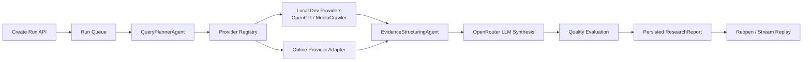

# Backend Agent Architecture

VoxLens backend now runs as an alpha-grade asynchronous DeepResearch pipeline.



## Runtime Flow

1. `POST /api/runs` creates a run record and queues it.
2. The in-process worker streams pipeline events while persisting every event to `scancast/runs/research/{runId}/events.jsonl`.
3. `GET /api/runs/{runId}/events` replays existing events first, then follows live events.
4. `GET /api/runs/{runId}` reopens the latest run metadata and report.
5. `GET /api/runs/{runId}/report` returns the persisted report when available.

Legacy endpoints remain available:

- `POST /api/research`
- `POST /api/research/stream`

## Agents

### QueryPlannerAgent

File: `backend/app/agents/planner.py`

- Normalizes `need` and `query`.
- Expands search phrases for Chinese and English sources.
- Builds crawl targets with platform, provider, query, limit, detail depth and concurrency.
- Defaults to Bilibili, Douyin, YouTube, Xiaohongshu, Zhihu, Kuaishou and Weibo.
- Excludes Baidu/Tieba from the alpha default set.

### Provider Registry

File: `backend/app/providers/registry.py`

- Separates provider modes from the research pipeline.
- `local`: OpenCLI, MediaCrawler and yt-dlp fallback for local/dev runs.
- `online`: independent production provider via `VOXLENS_ONLINE_PROVIDER_URL`.
- `hybrid`: use online when configured, then fall back to local.

### SocialCrawlerAgent

File: `backend/app/agents/crawler.py`

- Runs provider targets concurrently by platform.
- Deduplicates sources by normalized URL/title.
- Assigns stable source IDs early for streaming citations.

### EvidenceStructuringAgent

File: `backend/app/agents/evidence.py`

- Scores source quality by comments, transcript/text availability and URL completeness.
- Adds evidence channels and evidence scores.
- Sorts sources for report synthesis.

### ReportSynthesisAgent

Files:

- `backend/app/services/report_builder.py`
- `backend/app/services/llm_synthesis.py`

- Uses OpenRouter when `OPENROUTER_API_KEY` is configured.
- Defaults to `OPENROUTER_MODEL=z-ai/glm-5.1`.
- Restricts model citations to collected source IDs.
- Falls back to deterministic synthesis when the LLM is unavailable.

### QualityEvaluationAgent

File: `backend/app/services/quality.py`

Each report includes:

- Coverage score.
- Citation accuracy score.
- Evidence strength score.
- Conclusion risk / safety score.
- Overall quality score and warnings.

## Provider Matrix

| Platform | Local/dev provider | Online replacement | Evidence today |
| --- | --- | --- | --- |
| Bilibili | MediaCrawler + OpenCLI fallback | `VOXLENS_ONLINE_PROVIDER_URL` | Search, metadata, comments, subtitles |
| Douyin | MediaCrawler | `VOXLENS_ONLINE_PROVIDER_URL` | Search, metadata, comments |
| YouTube | OpenCLI + yt-dlp fallback | `VOXLENS_ONLINE_PROVIDER_URL` | Search, metadata, comments, transcript |
| Xiaohongshu | MediaCrawler | `VOXLENS_ONLINE_PROVIDER_URL` | Notes, media metadata, comments |
| Zhihu | MediaCrawler | `VOXLENS_ONLINE_PROVIDER_URL` | Answers/articles/zvideo metadata, comments |
| Kuaishou | MediaCrawler | `VOXLENS_ONLINE_PROVIDER_URL` | Short-video metadata, comments |
| Weibo | MediaCrawler | `VOXLENS_ONLINE_PROVIDER_URL` | Posts/media metadata, comments |

## Persistence

Run data is intentionally filesystem-based for alpha simplicity:

```text
scancast/runs/research/{runId}/
  record.json
  events.jsonl
  report.json
```

This can be replaced with Postgres/Redis/S3 without changing the frontend contract.
